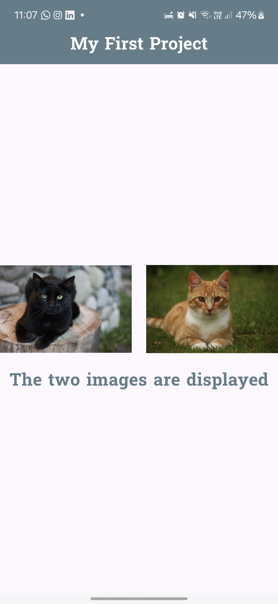

# Flutter Stateless Widget Image Display Project

This project demonstrates the creation of a simple Flutter application using a Stateless Widget to display images and text with specific styling requirements.

## 📸 Screens

